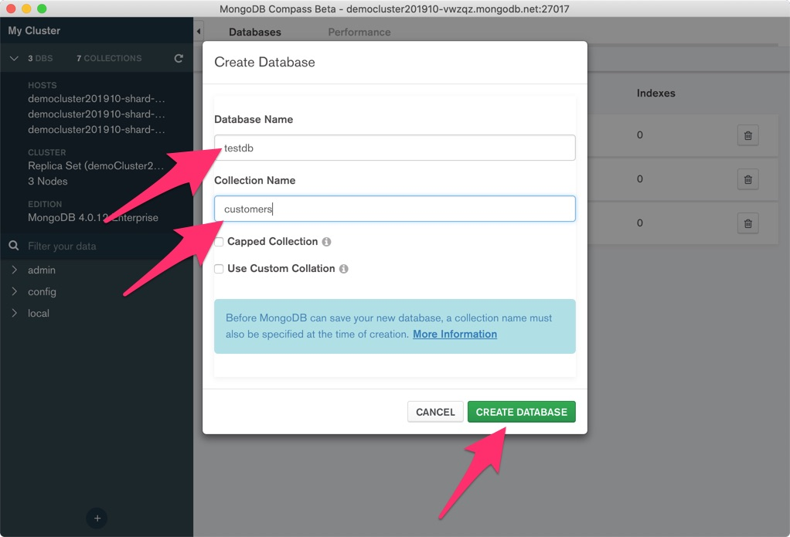

# MongoDB Document Validation Tutorial
# How to enforce data types and mandatory fields on your MongoDB Data

This tutorial will demonstrate how to use schema validation on MongoDB. Schema validation gives developers and DBAs the ability to enforce data rules for data quality purposes. So if we want a particular field to be mandatory, or we ant a field to have a certain data type or a certain size. 

The types of rules that can be enforced by MongoDB can be very sophisticated, and it provides greater level of control to DBAs and data architects, when compared to current capabilities of legacy RDBMS(s).

Throughout this demo we are going to work on a collection containing customer data for a magazine publisher.

## Required Prerequisites
To successfully complete this tutorial, the following software should be installed:

* Access to a MongoDB instance.  You can either download [MongoDB](https://www.mongodb.com/download-center/enterprise)
and set it up on a workstation/server.  Or, the *recommended* way to complete the workshop, is by using [MongoDB
Atlas](https://www.mongodb.com/cloud/atlas), the fully managed service from MongoDB.  To access, simply create an account
at [https://cloud.mongodb.com](https://cloud.mongodb.com) or login to an existing account you may have previously
created.

* [MongoDB Compass](https://www.mongodb.com/download-center/compass) -- Version 1.19 or above- Download links below- This is a GUI to MongoDB that will be used to 
write queries.

* [MongoDB mongo shell](https://www.mongodb.com/download-center/enterprise) -- Version 4.2 or above
*

## Demo - 01 - Required fields

To keep our initial example simple and easy to understand, initially we are going to create a customers collection and require the fields firstName and lastName.

I am going to demonstrate how to create document validation rules using both MongoDB Compass and the MongoDB mongo shell.

If you have already met the requirements above, first step is to start MongoDB Compass

First, let's do it using MongoDB Compass.

The first step is to 

The next image shows the initial screen of MongoDB Compass as we connect to a free tier MongoDB instance hosted on MongoDB Atlas. The arrows call attention to the authentication method, authentication database, and the button to add this cluster as a "favorite" inside of the Compass app.

XXXXX-Hello-XXXXX01


XXXXX-Hello-XXXXX02


XXXXX-Hello-XXXXX03


XXXXX-Hello-XXXXX04


XXXXX-Hello-XXXXX05


XXXXX-Hello-XXXXX06


XXXXX-Hello-XXXXX07


XXXXX-Hello-XXXXX08


XXXXX-Hello-XXXXX09


XXXXX-Hello-XXXXX10


Let's first create a JSONSchema that makes these two keys mandatory in any document that is inserted or updated in the collection.

```
let mySchema= {
  $jsonSchema: {
    required: [ 'firstName', 'lastName']
               }
};

```

Now let's create a collection that enforces the rules that we defined above, namely that both firstName and lastName are always required.

```
use testdb;
db.createCollection("customers", { validator: mySchema });
```

We can now see the new collection created:

```
show collections;
```
The next image shows creating the schema and creating a new collection with the above referred schema.


You could do the same thing with MongoDB Compass. 


db.getCollectionInfos()


```
let mySchema02= {
    bsonType: "object"
    ,required: ["firstName","lastName"]
    ,properties : {
    	firstName: {bsonType: "string"}
    }
};

use testdb;
db.runCommand( { collMod: customers, validator:{ $jsonSchema: mySchema02 } } )


```